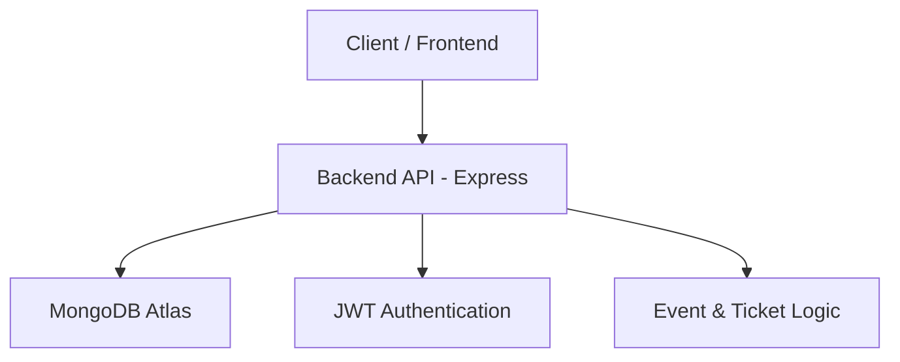

# Upcoming Organizer


## 1. Description

Upcoming Organizer is a backend service for managing events, attendees, and ticket distribution. It enables organizers to create and manage events, handle participant registrations, and issue tickets efficiently.

Built with **Node.js, Express, TypeScript, and MongoDB**, the backend provides secure authentication, event scheduling, attendee management, and ticket validation APIs. This makes it easy for developers to integrate event management features into frontend applications.

## 2. Tech Stack

- **Language & Runtime:** Node.js  
- **Framework:** Express  
- **Language:** TypeScript  
- **Database:** MongoDB (Atlas)

## 3. Features

- User authentication (JWT-based)  
- Event creation and management  
- Attendee management  
- Ticket booking and validation  
- Organizer module

## 4. Getting Started



## 5. Installation & Setup

### 5.1 Clone the repository:
```bash
git clone https://github.com/yourusername/upcoming-backend.git
```

### 5.2 Navigate into the project directory:
```bash
cd upcoming-backend
```

### 5.3 Install dependencies:
```bash
npm install
```

### 5.4 Create a .env file in the root directory and add your environment variables (see section 6).

### 5.5 Run the backend locally:
```bash
npm run dev
```

The server should now be running at http://localhost:10000 (or your configured port).

## 6. Environment Variables

Create a `.env` file with the following variables (replace placeholders with your own values):

```env
MONGO_URI=<your_mongo_uri>

# JWT Keys
JWT_SECRET=<your_jwt_secret>
USER_ROLE=user
ORGANIZER_ROLE=organizer
ADMIN_ROLE=admin
ACCESS_TOKEN_EXPIRY_TIME=15m
REFRESH_TOKEN_EXPIRY_TIME=7d
```

## 7. Database

This backend uses MongoDB Atlas. Make sure your `MONGO_URI` in `.env` is correctly configured to connect to your Atlas cluster.

## 8. Deployment

The backend is deployed on Render:

https://upcoming-backend.onrender.com

You can access the APIs directly via this URL.